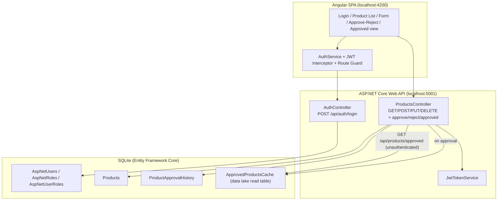

# Product Management System — Architecture

## Key decisions

- **Workflow state machine** lives on `Product.Status` (`Draft → PendingApproval → Approved`, plus
  `SoftDeleted`). Pending delete requests are tracked with `PendingDelete` while the status stays
  `PendingApproval`; a manager approving a `PendingDelete` moves the record straight to `SoftDeleted`
  and removes its row from the cache.
- **Role enforcement is server-side.** `[Authorize(Roles=...)]` guards mutations, capturers can only
  edit products they created, and a manager cannot approve their own change (403).
- **Data lake read path** is the separate `ApprovedProductsCache` table, populated on approval and
  served by `GET /api/products/approved` with **no auth** — proving an independent fast-read table.
- **Authentication** uses ASP.NET Identity + JWT (OAuth 2.0/OIDC-compatible pattern), not a
  hand-rolled system.
