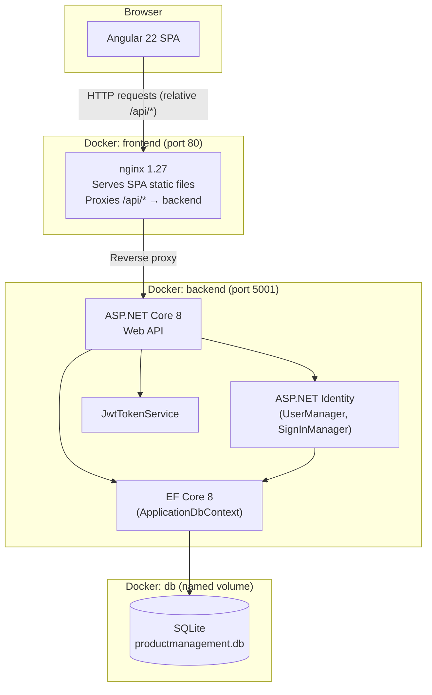
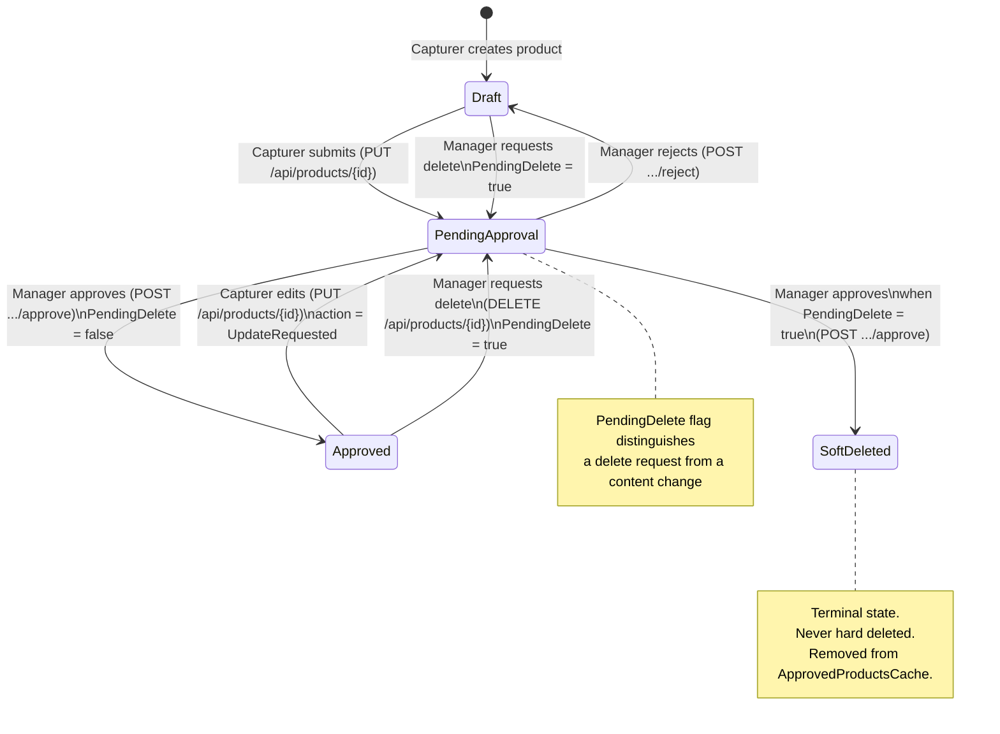
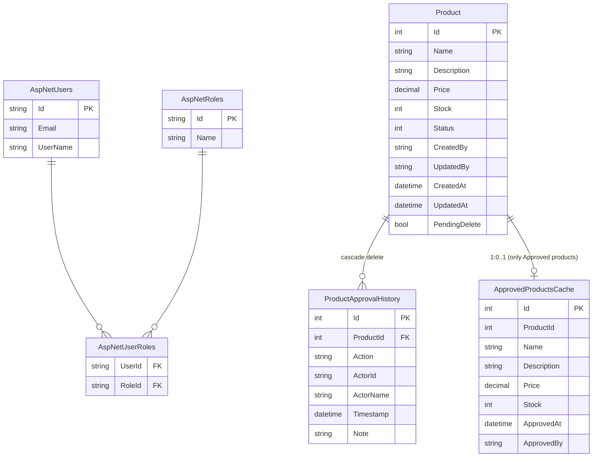

# Architecture — Product Management System

## 1. System Overview

The Product Management System is an internal workflow tool for managing product data through a two-role approval process. Capturers create and edit product records; Managers approve, reject, or soft-delete them. No change goes live without an independent Manager approval.

**What this system IS:**

- A product approval workflow API (ASP.NET Core 8)
- An Angular 22 SPA for workflow interaction
- A read-only public endpoint serving approved products to downstream consumers

**What this system is NOT:**

- A Client Portal (out of scope)
- An Order Management System (out of scope)
- A message broker / event bus consumer or producer
- A real data lake (Databricks, Synapse — out of scope)
- A multi-tenant or multi-region system

---

## 2. Component Diagram



**Port layout:**

| Container | Internal port | Host port |
| --------- | ------------- | --------- |
| frontend  | 80            | 80        |
| backend   | 5001          | 5001      |
| db        | —             | —         |

---

## 3. Layer Structure

```
ProductManagementSystem.Api/
├── Controllers/          HTTP translation only: parse request → call service → map to IActionResult
│   ├── AuthController    Login, Me
│   └── ProductsController  CRUD + workflow actions
├── Services/             Business / domain logic
│   ├── JwtTokenService   Creates signed JWT, returns token + expiry
│   └── ProductService    [being extracted] All product domain operations
├── Data/                 Persistence
│   ├── ApplicationDbContext  EF DbContext + model configuration
│   └── DbInitializer     Migrations + idempotent seed
└── Models/               Domain entities and value types
    ├── Product
    ├── ProductApprovalHistory
    ├── ApprovedProductsCache
    ├── ProductStatus (enum)
    └── JwtSettings

product-management-client/src/app/
├── auth/                 AuthService, authGuard, authInterceptor, auth.models
├── products/             ProductService, product.models
│   ├── product-list/     List + workflow action buttons
│   ├── product-form/     Create / edit form
│   └── approved-products/ Public read-only approved list
├── login/
└── health/
```

**Rule:** Controllers call services. Services own all database access and business logic. Models have no behaviour (plain data). This is enforced by dependency injection — `ProductsController` will inject `ProductService`, not `ApplicationDbContext`.

---

## 4. Authentication and Authorisation

### Flow

```
POST /api/auth/login
  → UserManager.FindByEmailAsync
  → SignInManager.CheckPasswordSignInAsync (enforces lockout)
  → JwtTokenService.CreateToken → returns { Token, ExpiresAt }
  → Controller returns LoginResponse

Subsequent requests:
  → Angular authInterceptor attaches "Authorization: Bearer <token>"
  → JWT middleware validates: signature, issuer, audience, expiry, clock skew = 0
  → ClaimsPrincipal available in controller via User.*
```

### Roles

| Role     | Assigned to      | What they can do                                                |
| -------- | ---------------- | --------------------------------------------------------------- |
| Capturer | Data entry users | Create product, edit own products, view own + approved products |
| Manager  | Approvers        | View all products, approve/reject/soft-delete                   |

Roles are seeded at startup via `DbInitializer.SeedAsync`. Role assignment is stored in `AspNetUserRoles`.

### Self-Approval Guard

A Manager cannot approve a product change they created. Enforced in `ProductService.ApproveAsync`:

```csharp
if (product.CreatedBy == actorId)
    return new ForbiddenResult("A manager cannot approve their own change.");
```

This is a domain invariant, not just an HTTP concern — it lives in the service, not the controller.

### Claims Used

| Claim                  | Source                 | Used for                                      |
| ---------------------- | ---------------------- | --------------------------------------------- |
| `NameIdentifier` (sub) | `user.Id`              | `CreatedBy`, `UpdatedBy`, self-approval check |
| `Email`                | `user.Email`           | `ActorName` in history entries                |
| `Role`                 | ASP.NET Identity roles | `[Authorize(Roles=...)]` enforcement          |

---

## 5. Approval Workflow State Machine



**PendingDelete flag semantics:** `PendingDelete=true` with `Status=PendingApproval` means the approval being requested is for a deletion, not a content change. This drives different behaviour in `ApproveAsync` — the same HTTP endpoint handles both cases, disambiguated by this flag.

---

## 6. Data Architecture

### Entity-Relationship



### ApprovedProductsCache — Read Path

`ApprovedProductsCache` is a **denormalised read-projection** of approved products. It exists for one reason: `GET /api/products/approved` is `[AllowAnonymous]` and must be cheap, with no auth overhead, no joins to Identity tables, and no need to filter by status.

**Write path:** On `ApproveAsync` (normal approval), the cache row is upserted (insert if missing, update if present).
**Invalidation:** On `ApproveAsync` (delete approval), the cache row is removed.
**Consistency:** The upsert/remove and the Product status update happen inside a single `SaveChangesAsync` call within a transaction.

This is not a real data lake — the name is inherited from the PRD requirement for a "data lake read table". It is a simple denormalised table.

### Indexes

| Table                  | Column    | Index                                | Reason                                             |
| ---------------------- | --------- | ------------------------------------ | -------------------------------------------------- |
| Products               | Status    | `IX_Products_Status`                 | Filter by status in GetAll                         |
| Products               | CreatedBy | `IX_Products_CreatedBy`              | Capturer GetAll filter (WHERE CreatedBy = @userId) |
| ApprovedProductsCache  | ProductId | `IX_ApprovedProductsCache_ProductId` | Cache lookup on approval                           |
| ProductApprovalHistory | ProductId | FK index (auto)                      | History load by product                            |

---

## 7. Docker Deployment

### Container Topology

```
┌─────────────────────────────────────────────────┐
│  docker-compose.yml                             │
│                                                 │
│  ┌──────────┐    ┌──────────┐    ┌──────────┐  │
│  │ frontend │    │ backend  │    │    db    │  │
│  │  :80     │───▶│  :5001   │───▶│  volume  │  │
│  │  nginx   │    │  .NET 8  │    │  SQLite  │  │
│  └──────────┘    └──────────┘    └──────────┘  │
│       ▲                                         │
│  :80 exposed                                    │
└─────────────────────────────────────────────────┘
```

### Secret Injection

All secrets are injected at runtime via environment variables. Nothing sensitive is baked into images.

| Variable                               | Container | How set                                       |
| -------------------------------------- | --------- | --------------------------------------------- |
| `Jwt__Key`                             | backend   | `.env` file (generated by `start.sh`)         |
| `Seed__Password`                       | backend   | `.env` file                                   |
| `Cors__Origin`                         | backend   | `.env` file                                   |
| `ConnectionStrings__DefaultConnection` | backend   | `docker-compose.yml` hardcoded path to volume |

### Startup Sequence

1. `db` container health check passes (SQLite file accessible)
2. `backend` starts, `depends_on: db: condition: service_healthy`
3. `Program.cs` runs `db.Database.Migrate()` (applies pending EF migrations)
4. `DbInitializer.SeedAsync` runs (idempotent — skips existing roles/users)
5. `frontend` starts, `depends_on: backend: condition: service_healthy`
6. nginx serves SPA, proxies `/api/*` to backend container

### Scaling Notes

- **Single-node:** SQLite + named volume. Works today.
- **Horizontal backend:** Replace SQLite with PostgreSQL/SQL Server. Update `UseSqlite` → `UseNpgsql`/`UseSqlServer` and connection string. No code changes to services/controllers required.
- **Frontend:** Stateless static files — scale with any CDN or additional nginx instances.

---

## 8. Key Architectural Decisions (ADRs)

### ADR-001: SQLite over PostgreSQL

**Status:** Accepted
**Context:** Single-node deployment, no concurrency requirements at launch, simpler Docker setup.
**Decision:** SQLite with EF Core. Data persisted to a named Docker volume.
**Consequences:** Cannot scale horizontally while SQLite is in use. Migration path: swap `UseSqlite` for `UseNpgsql`, update connection string, run `dotnet ef migrations add` for any SQLite-specific column types.

### ADR-002: JWT Bearer tokens over HttpOnly cookies

**Status:** Accepted with known risk
**Context:** Simpler CORS handling for an SPA, no CSRF surface, easier to test with curl/Swagger.
**Decision:** JWT stored in memory (Angular signal) and `localStorage` for session persistence across tabs.
**Consequences:** `localStorage` is accessible to JavaScript — XSS risk. Documented in FIXES.md SEC-06. Migration to HttpOnly cookies is a Phase 6 initiative requiring breaking changes to both backend (Set-Cookie) and frontend (drop localStorage).

### ADR-003: Denormalised ApprovedProductsCache over a view or live query

**Status:** Accepted
**Context:** `GET /api/products/approved` is `[AllowAnonymous]` and expected to be the highest-traffic endpoint (downstream consumers). Filtering `Products WHERE Status = Approved` with an auth join is heavier than needed.
**Decision:** Maintain a separate `ApprovedProductsCache` table. Upsert on approval, remove on soft delete. Accept the consistency burden (cache must be kept in sync within the same transaction as the Product update).
**Consequences:** Two writes per approval action. Cache can drift if a transaction partially fails — mitigated by wrapping upsert + product update in a single transaction.

### ADR-004: Soft delete via approval workflow

**Status:** Accepted
**Context:** PRD requirement: no hard deletes. Delete requests must also go through the approval workflow to prevent unilateral data destruction.
**Decision:** `DELETE /api/products/{id}` does not delete — it sets `PendingDelete=true` and `Status=PendingApproval`. A second Manager approval transitions to `SoftDeleted`. Self-approval rule applies.
**Consequences:** Product records and their history are permanently retained. `SoftDeleted` products are excluded from list views. `ApprovedProductsCache` row is removed on soft delete approval.

### ADR-005: EF Core Code First with migrations

**Status:** Accepted
**Context:** Schema must be version-controlled and reproducible across environments.
**Decision:** All schema changes are made in C# model/configuration and expressed as EF migrations. `db.Database.Migrate()` runs on startup.
**Consequences:** Cannot make ad-hoc schema changes outside the codebase. Migration history is in source control (`Migrations/`). Adding columns requires a new migration and re-deploy.

---

## 9. Security Posture

### Enforced

- JWT signature, issuer, audience, and lifetime validation (ClockSkew = 0)
- Role-based authorisation via `[Authorize(Roles = ...)]`
- Self-approval forbidden at service layer
- Account lockout after 5 failed login attempts (5-minute lockout)
- Input validation: Name required, Price ≥ 0, Stock ≥ 0, Description ≤ 2000 chars, Reason ≤ 500 chars
- CORS origin locked to configured value (not wildcard)
- Secrets injected at runtime via env vars (not in source)

### Deferred / Known Risks

- JWT in `localStorage` (XSS risk) — see ADR-002 and FIXES.md SEC-06
- No rate limiting on login or public endpoints — future middleware addition
- Password minimum length is 12 chars; no rotation policy

---

## 10. Out of Scope

The following are explicitly NOT part of this system and must not be built here:

- Client Portal (separate application)
- Order Management System (separate application)
- Message queues / event bus / pub-sub
- Real data lake tooling (Databricks, Azure Synapse, Blob Storage JSON)
- IaC (Terraform, Bicep, Pulumi)
- Email notifications
- Multi-tenancy
- Audit log export / reporting
- Product image uploads
