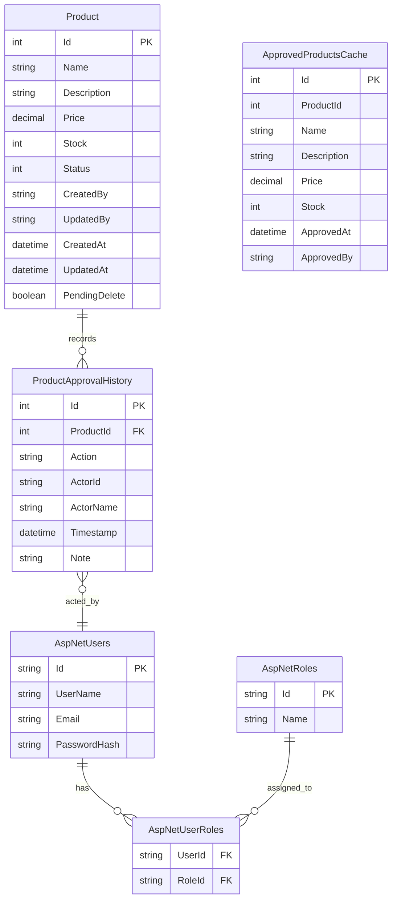

# Product Management System — ERD

## Notes

- `Product.CreatedBy` / `UpdatedBy` store the `AspNetUsers.Id` (Capturer user id).
- `ProductApprovalHistory` is the workflow audit trail (Created, Submitted, UpdateRequested,
  Approved, Rejected, SoftDeleteRequested, SoftDeleted).
- `ApprovedProductsCache` is the denormalized "data lake" read table: one row per approved product,
  upserted on approval and removed on soft delete.
